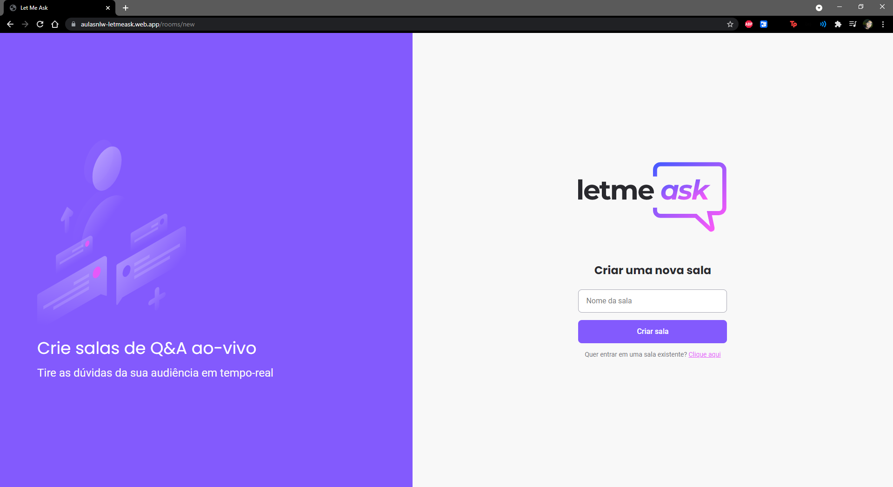

<h1 align="center">
  
</h1>

   

 

  

##  Tecnologias

Esse projeto foi desenvolvido com as seguintes tecnologias:

- [React](https://reactjs.org)
- [Firebase](https://firebase.google.com/)
- [TypeScript](https://www.typescriptlang.org/)

##  Projeto

o Let Me Ask é um projeto desenvolvido durante a 6ª edição da Next Level Week, denominada NLW Together, com o objetivo de permitir uma melhor intereção entre palestrante/audiência durante os tempos de isolamento social. Por meio do Let Me Ask é possível criar várias salas onde os participantes da palestra poderão mandar suas perguntas e dar likes nas perguntas que acharem interessantes. Por sua vez, o criador da sala tem o poder de deixar a pergunta em evidência, marcar como respondida, ou até mesmo deletar a pergunta caso necessário.

## Passos Complementares
 * Foi desenvolvida uma proteção para a rota do admin, onde fica o gerencimento das perguntas.
 * Foi feito uma refatoração das páginas, buscando facilitar a manutenção por terceiros.

## Para o futuro:
 * Serão adicionadas animações de loading durante o carregamento das informações do firebase.
 * Será adicionada responsividade, buscando abranger os dispositivos móveis e diferentes tipos de resoluções.
 * Suporte para troca de temas Dark/Light

## Requisitos
 - [Node](https://nodejs.org/en/)
 - [Yarn](https://yarnpkg.com/)
 - [Firebase](https://firebase.google.com/)

##  Como executar

- Clone o repositório.
- Crie um arquivo ".env.local" e complete com os dados do arquivo ".env.example" junto com suas informações do firebase.
- Instale as dependências com `yarn`.
- Inicie o servidor com `yarn dev`.

Agora você pode acessar [`localhost:3000`](http://localhost:3000) do seu navegador.

## Licença

Esse projeto está sob a licença MIT. 

## Comentários

Sinta-se a vontade para me contatar nas redes sociais caso precise de ajuda, queira dar alguma dica, ou qualquer que seja a necessidade.
- [Linkedin](https://www.linkedin.com/in/vinicyus-silva/)
- [GitHub](https://github.com/silvavinicyus/)
---

ReadMe baseado nos oferecidos pela [Rocketseat](https://discordapp.com/invite/gCRAFhc)
